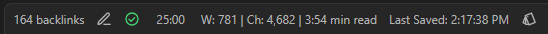
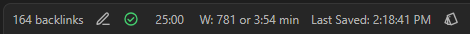
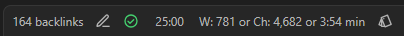

# 📊 StatBar

StatBar adds a word and character counter to the status bar in Obsidian. It updates automatically as you type and intelligently ignores Markdown syntax when counting words, providing a seamless writing experience.

| Description |                                     Screenshots |
| ----------- | ----------------------------------------------: |
| Default     |  |
| Last Saved  |  |
| Custom      |  |

## ✨ Features

- Displays a live word count in the status bar
- Shows character count alongside word count, including an option to display character count without spaces
- Automatically updates as you type, ensuring you always have the latest counts
- Ignores Markdown syntax when counting words, providing accurate results for your content
- Customizable labels allowing you to personalize your status bar
- Toggleable components, giving you control over what information is shown:
    - Word count
    - Character count
    - Estimated read time
    - Last saved time

## 📦 Installation

### From Obsidian Community Plugins (_NOT AVAILABLE YET_)

1. Open **Settings** → **Community Plugins** in Obsidian.
2. Disable **Safe Mode** if it's enabled.
3. Click **Browse** and search for "StatBar"
4. Click **Install**, and then **Enable** the plugin.

### Manual Installation

1. Download the latest release files (`main.js`, `manifest.json`, `styles.css`) from the [releases page](https://github.com/semanticdata/obsidian-statbar/releases).
2. Create a new folder named `statbar` inside your vault's `.obsidian/plugins/` directory.
3. Copy the downloaded files into this new folder.
4. Reload Obsidian (Ctrl/Cmd + R) and enable the plugin in the settings.
