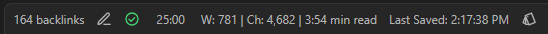
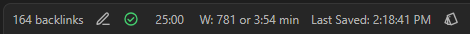
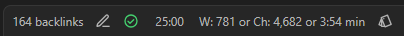

# 📊 StatBar

StatBar adds a word and character counter to the status bar in Obsidian. It updates automatically as you type and intelligently ignores Markdown syntax when counting words, providing a seamless writing experience.

| Description |                         Screenshots |
| ----------- | ----------------------------------: |
| Default     |  |
| Last Saved  |  |
| Custom      |  |

## ✨ Features

- Displays a live word count in the status bar
- Shows character count alongside word count, including an option to display character count without spaces
- Automatically updates as you type, ensuring you always have the latest counts
- Ignores Markdown syntax when counting words, providing accurate results for your content
- Customizable labels allowing you to personalize your status bar
- Toggleable components, giving you control over what information is shown:
  - Word count
  - Character count
  - Estimated read time
  - Last saved time

## 📦 Installation (_NOT AVAILABLE IN THE COMMUNITY PLUGINS YET!_)

1. Open Obsidian Settings
2. Navigate to Community Plugins (_NOT AVAILABLE YET!_) and disable Safe Mode
3. Click Browse and search for "Status Bar Word Counter"
4. Install the plugin
5. Enable the plugin in your Community Plugins list

### 🏗️ Building

1. Clone this repository
2. Run `npm install`
3. Run `npm run dev` to start compilation in watch mode
4. Run `npm run build` to build the plugin
5. Run `npm run lint` to check for linting errors
6. Run `npm test` to run tests

### 📁 Manual Installation

1. Create a new folder `statbar` in your vault's `.obsidian/plugins` folder
2. Copy `main.js`, `manifest.json`, and `styles.css` to the new folder
3. Reload Obsidian to load the plugin

## Releasing new releases

- Update your `manifest.json` with your new version number, such as `1.0.1`, and the minimum Obsidian version required for your latest release.
- Update your `versions.json` file with `"new-plugin-version": "minimum-obsidian-version"` so older versions of Obsidian can download an older version of your plugin that's compatible.
- Create new GitHub release using your new version number as the "Tag version". Use the exact version number, don't include a prefix `v`. See here for an example: <https://github.com/obsidianmd/obsidian-sample-plugin/releases>
- Upload the files `manifest.json`, `main.js`, `styles.css` as binary attachments. Note: The manifest.json file must be in two places, first the root path of your repository and also in the release.
- Publish the release.

> You can simplify the version bump process by running `npm version patch`, `npm version minor` or `npm version major` after updating `minAppVersion` manually in `manifest.json`.
> The command will bump version in `manifest.json` and `package.json`, and add the entry for the new version to `versions.json`

## Adding your plugin to the community plugin list

- Check the [plugin guidelines](https://docs.obsidian.md/Plugins/Releasing/Plugin+guidelines).
- Publish an initial version.
- Make sure you have a `README.md` file in the root of your repo.
- Make a pull request at <https://github.com/obsidianmd/obsidian-releases> to add your plugin.

## API Documentation

See <https://github.com/obsidianmd/obsidian-api>

## 📜 License

The code in this repository is available under the [MIT License](LICENSE).
